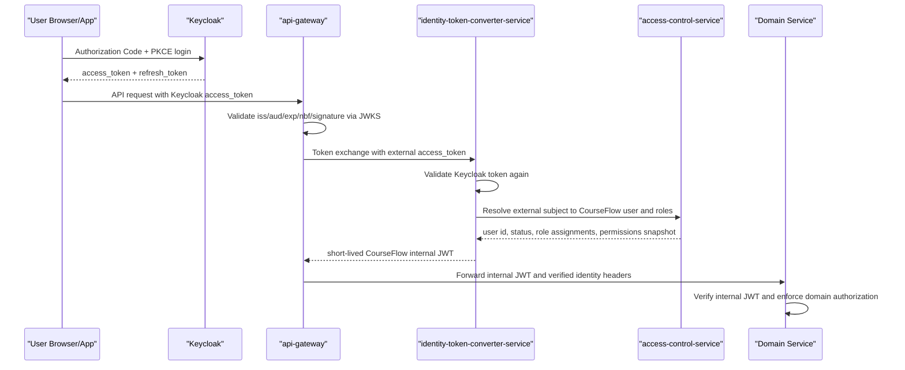

# Keycloak Enterprise Adoption for CourseFlow

## Decision

CourseFlow should adopt Keycloak as the external OAuth2/OpenID Connect Authorization Server, not as
the source of truth for LMS business authorization.

The enterprise target is:

- Keycloak owns authentication, SSO, MFA, identity brokering, OIDC clients, sessions, external access
  token issuance, key rotation and login policy.
- CourseFlow owns learner/admin profiles, LMS roles scoped to organizations/courses/sections,
  enrollment, instructor/reviewer/grader permissions, audit history and domain authorization.
- `api-gateway` is the only external API trust boundary.
- `identity-token-converter-service` becomes the CourseFlow internal security-token service. It
  validates Keycloak access tokens, resolves the CourseFlow user, enriches claims from CourseFlow
  authorization data, and issues short-lived internal tokens for downstream services.
- Downstream services validate only CourseFlow internal tokens for internal identity headers and
  service-to-service calls.

This is the same separation used in mature enterprise systems: the IdP proves who the caller is;
the product decides what the caller can do inside product-specific resources.

## Current State

Keycloak is the only supported external login authority. It issues external OAuth2/OIDC access
tokens, `api-gateway` validates issuer, JWKS and audience, then
`identity-token-converter-service` validates the token again, resolves the CourseFlow user through
`access-control-service`, and issues a short-lived internal JWT.

`common-library` validates internal JWTs and protects propagated `X-User-*` headers. In OIDC mode,
custom auth endpoints are blocked at the gateway so Keycloak remains the only supported edge login
authority. Admin user lifecycle now goes through `user-management-service`, which provisions and
deactivates Keycloak users through the Keycloak Admin API, mirrors CourseFlow authorization data in
`access-control-service`, and keeps profile data in `user-management-service`.

Internal JWT signing now supports `HS256` for local/demo compatibility and `RS256` for the production
profile. The token converter also exposes an internal JWKS endpoint and supports internal
`client_credentials` / trusted-user token issuance, so domain services can request service-to-service
tokens from the converter instead of holding signing keys. Domain services can verify internal JWTs
through the converter JWKS endpoint with cache and `kid` refresh. Trusted-user issuance requires the
caller to pass the verified inbound internal user JWT as `actor_token`; the converter rejects
self-asserted `user_id`, `roles` and `role_assignments` in this grant. The remaining gaps are mobile
native callback/e2e verification, full Keycloak end-to-end verification in Docker, key rotation
drills and auth metrics.

## Target Flow

Important rules:

- APIs must accept Keycloak access tokens, not ID tokens.
- External tokens are validated locally with issuer and JWKS, not by calling Keycloak introspection
  on every request.
- Gateway validation is necessary but not sufficient. The token converter must validate the external
  token again because it is an internal security boundary.
- `X-User-*` remains a compatibility payload only. It is trusted only when an internal JWT verifies.
- User identity must be linked by immutable issuer plus subject, not by email alone after first
  provisioning.

## Keycloak Responsibility

Keycloak should be configured as the enterprise IAM layer:

| Area | Keycloak owns |
|---|---|
| Login | Authorization Code + PKCE for web, admin and mobile clients |
| SSO | Browser session, refresh token policy, logout endpoints |
| MFA | Required actions, OTP/WebAuthn where supported by the deployment |
| Federation | LDAP, SAML/OIDC identity providers, social login if needed |
| Token signing | External OAuth2 access tokens signed with asymmetric keys and exposed through JWKS |
| Session control | SSO lifetime, refresh token reuse, revocation, offline sessions if explicitly approved |
| Coarse IAM roles | Platform-level or client-level roles such as `platform-admin`, `support`, `tenant-admin` |
| Groups/organizations | Coarse institution or department membership used for provisioning and claim hints |
| Client policy | PKCE, redirect URI discipline, token lifetimes, optional FAPI/OAuth 2.1 style hardening |

Keycloak should not own high-cardinality LMS permissions such as:

- instructor of course 123
- grader for assignment 456
- reviewer for course draft 789
- learner enrolled in section ABC
- certificate eligibility
- grade override permission for one course

Those belong in CourseFlow services because they change with product workflows and need product
audit, product transactions and product-specific invariants.

## CourseFlow Responsibility

CourseFlow splits product identity data across two services and deliberately does not build another
IAM service beside Keycloak:

- `access-control-service` owns CourseFlow authorization: immutable Keycloak `issuer + subject`
  links, CourseFlow user id resolution, role assignments, scoped permissions, authorization checks
  and audit history. It is a product authorization service, not an IAM.
- `user-management-service` owns profile and directory data: display name, avatar, bio, locale,
  timezone, public profile, learner/instructor profile views and batch profile summaries. Public
  profile reads only expose profiles marked `PUBLIC`; summary batch lookup is the preferred
  authenticated/internal way to hydrate avatar/name in UI lists.
- The former custom password/JWT service has been decommissioned; long-term password/session policy,
  LMS authorization and profile directory data live in Keycloak, access-control and user-management.
- Keycloak/admin events or provisioning callbacks may feed CourseFlow user lifecycle, but random
  domain services must not call Keycloak Admin API directly.

## Client Model

Recommended Keycloak clients:

| Client | Type | Flow | Notes |
|---|---|---|---|
| `courseflow-learner-web` | public | Authorization Code + PKCE | Next.js learner/public app |
| `courseflow-admin-web` | public or confidential BFF | Authorization Code + PKCE | Admin UI; gateway still enforces operator gate |
| `courseflow-mobile` | public native | Authorization Code + PKCE | No embedded password login |
| `courseflow-gateway` | confidential | Resource server / optional token exchange client | Validates tokens and calls converter |
| `courseflow-token-converter` | confidential | Token exchange / client credentials | Internal STS integration |
| `courseflow-service-*` | confidential | Client credentials if moving service tokens to Keycloak | Use only for machine actors |

Do not use Resource Owner Password Credentials / Direct Access Grants for normal login. It exposes
passwords to CourseFlow clients and bypasses the policy flexibility we want from Keycloak.

## Token Design

External Keycloak access token should carry only stable IAM facts:

- `iss`: Keycloak realm issuer, for example `https://auth.courseflow.example/realms/courseflow`
- `sub`: immutable Keycloak user id
- `aud`: API audience accepted by the gateway, for example `courseflow-api`
- `azp`: client id that obtained the token
- `scope`: OAuth scopes such as `openid profile email courseflow-api`
- coarse roles or groups when useful
- `email` and `email_verified` as profile hints, not primary identity keys

External tokens must not emit CourseFlow product identifiers such as `uid` or `courseflow_user_id`.
CourseFlow user id is resolved from `iss + sub` by `access-control-service` and appears only in the
internal JWT or user-management responses.

CourseFlow internal JWT should carry product facts with a very short TTL:

- `iss`: CourseFlow internal STS
- `aud`: target internal services or `courseflow-services`
- `token_use`: `internal`
- `actor_type`: `user` or `service`
- `uid`: CourseFlow user id
- `external_issuer` and `external_sub` for audit traceability
- `roles` and `role_assignments` from CourseFlow authorization
- `scope` or `scp` for internal service permissions
- `jti`, `iat`, `nbf`, `exp`

Current implementation supports two internal signing modes:

- `HS256`: local/demo migration mode using `COURSEFLOW_INTERNAL_JWT_SECRET`.
- `RS256`: production profile mode using `COURSEFLOW_INTERNAL_JWT_PRIVATE_KEY` for signing and
  `COURSEFLOW_INTERNAL_JWT_PUBLIC_KEY` for verification.

Service-to-service issuance supports two modes:

- `local`: the compatibility mode where `InternalJwtService` signs directly.
- `sts`: production mode where `InternalJwtService` calls `identity-token-converter-service`
  with `client_credentials` or trusted-user delegation and receives a short-lived internal JWT.
  Each production service authenticates with its own STS client secret, and the converter grants
  only the scopes configured for that client.
  Trusted-user delegation forwards the already-verified inbound internal JWT as `actor_token`; it
  does not let a service submit arbitrary user ids or roles.

Enterprise hardening target after this step: exercise key rotation and observability around STS/JWKS
in a running cluster. Sharing an HMAC secret, or distributing an RSA private key outside the
converter/STS, is acceptable only as a transition because any compromised signing service can
impersonate other actors.

## Realm and Tenant Strategy

Default recommendation for CourseFlow: one Keycloak realm per environment/platform and represent
enterprise customers with organizations/groups plus CourseFlow tenant/org data.

Use one realm per tenant only when a tenant requires hard IAM isolation, custom realm-level policies,
separate SAML/OIDC federation lifecycle, or strict operational separation. Multi-realm SaaS is more
expensive to operate because every realm needs client config, keys, federation, policies, tests,
backups and upgrade validation.

CourseFlow tenant, department, course and section membership remains in CourseFlow databases. Keycloak
groups can help bootstrap or hint membership, but they should not become the LMS enrollment database.

## Production Keycloak Requirements

Keycloak cannot run in production as `start-dev`.

Production requirements:

- Run Keycloak behind HTTPS with a stable public hostname.
- Use an external production database with backup and restore drill.
- Pin a supported Keycloak version and define an upgrade playbook.
- Use asymmetric signing keys and key rotation policy.
- Disable default demo/admin credentials and protect the admin console behind private access.
- Configure exact redirect URIs and exact web origins.
- Disable Direct Access Grants unless there is an explicit machine-approved exception.
- Enable health, metrics, audit/admin events and log shipping.
- Configure SMTP for required actions and account recovery if email workflows are enabled.
- Validate the production realm template with `scripts/validate-keycloak-realm.mjs` so PKCE clients,
  API audience mapping, password/session/OTP policy, no-demo-users and no-localhost redirects remain
  enforced in source control.
- Export realm configuration as code for repeatable environments.
- Separate local/dev realm config from production realm config.

## Migration Plan

### Phase 1: OIDC verifier under the current gateway

- Add a gateway external-token verifier abstraction.
- Add a Keycloak verifier using issuer URI, JWKS, audience validation and clock skew.
- Add the same verifier capability to `identity-token-converter-service`.
- Add tests for issuer mismatch, audience mismatch, expired token, key rotation and missing subject.

Implementation note: gateway and converter now validate external access tokens with
`KEYCLOAK_ISSUER_URI`, `KEYCLOAK_JWK_SET_URI` and `KEYCLOAK_AUDIENCE` before the converter resolves
CourseFlow roles from `access-control-service`.
Local Docker now imports `backend/infra/docker/keycloak/courseflow-realm.json`, which defines the
CourseFlow realm, learner/admin public PKCE clients and the `courseflow-api` audience mapper. The
React admin and learner web use Authorization Code + PKCE. The Flutter app uses Keycloak/AppAuth
with the `courseflow-mobile` public PKCE client. The local realm
includes demo users only for developer testing. Production uses
`backend/infra/docker/keycloak/courseflow-realm.prod-template.json` as a no-demo-users starting point
and does not import the local realm. Full Keycloak e2e tests and mobile platform callback
configuration remain follow-up work.

### Phase 2: Identity mapping and converter enrichment

- Add `user_external_identities` with `provider`, `issuer`, `subject`, `user_id`, `linked_at`,
  `last_seen_at`, `email_at_link`, `email_verified_at_link` and status.
- Token converter maps Keycloak `iss + sub` to CourseFlow `user_id`.
- First-time provisioning is explicit: invite, registration approval, SCIM, admin import or trusted
  JIT provisioning. Do not silently create privileged users from arbitrary email domains.
- The provisioning worker/importer calls `access-control-service`
  `POST /internal/identities/provision` to create the authorization link and role hints, then calls
  `user-management-service` `POST /internal/users/provision-profile` to create display name/avatar
  directory data. Profile summary batch responses preserve the requested user id order and omit
  missing profiles.
- Token converter enriches internal JWT from CourseFlow roles and scoped assignments.
- `access-control-service` enforces the supported assignment scopes (`PLATFORM`, `TENANT`,
  `APPLICATION`, `ORG`, `DEPARTMENT`, `COURSE`, `SECTION`), requires non-platform `scopeId` values,
  and validates each authorization check against the permission definition scope (`ANY`, `PLATFORM`,
  `TENANT`, `APPLICATION`, `ORG`, `DEPARTMENT`, `COURSE`, `SECTION`). `APPLICATION` scope ids use
  `tenantId:applicationId`. This keeps Keycloak coarse and CourseFlow precise.
- Authorization checks may include `ancestorScopes` supplied by the domain service that owns the
  resource topology, so department/org assignments can apply to course/section checks without
  turning access-control into a topology aggregator. Access-control accepts those ancestors only
  from service internal JWTs with `internal:authz:assert-topology`.
- Admin user list/detail/create/deactivate/privacy-export are migrated to a lifecycle facade in
  `user-management-service`: profile/display fields come from user-management, email/status/primary
  role and role-grant exports come from `access-control-service`, and account enablement/session
  revocation/setup email are delegated to Keycloak Admin REST through the dedicated
  `keycloak-user-lifecycle` service account. The facade asks `access-control-service` for
  `platform:admin` before serving backoffice reads or lifecycle mutations. Creating a user does not
  grant product roles inline; role assignment is a separate access-control operation with explicit
  `roleId`, `scopeType` and `scopeId`.
- `GET /api/v1/users/me` is also routed to `user-management-service` as a compatibility facade. It
  resolves CourseFlow user id/email/status/primary role from access-control, and user-management owns
  display name/avatar.
- Web and mobile clients must not treat Keycloak `realm_access.roles` as CourseFlow product roles.
  After Keycloak login they hydrate `/api/v1/users/me`; `user-management-service` returns profile
  fields plus the role/status resolved from `access-control-service`.

### Phase 3: Client login migration

- Move learner web, admin web and mobile login to Authorization Code + PKCE.
- Remove password handling from frontend clients.
- The default gateway route table no longer exposes `/api/v1/auth/**`; the global gateway filter
  returns `410 Gone` for every `/api/v1/auth/**` path so clients use Keycloak as the edge login
  authority.
- Move MFA and password reset flows to Keycloak required actions.
- Update logout to use OIDC logout and revoke/clear refresh tokens.

### Phase 4: Decommission custom external JWT

- Stop issuing CourseFlow HS256 user access tokens.
- Remove the external user-auth shared HMAC secret.
- Keep CourseFlow user authorization in `access-control-service` and profile/directory data in
  `user-management-service`.
- Keep downstream services unchanged where possible because they already consume internal JWT.

### Phase 5: Harden internal service authentication

- Current implementation: add RS256 internal JWT mode and require it in the prod validation profile.
- Current implementation: add STS `client_credentials` / trusted-user grants and internal JWKS.
- Current implementation: trusted-user grants require a signed internal user `actor_token` and reject
  self-asserted user/role form fields.
- Current implementation: production Compose defaults domain services to STS-issued service tokens
  while keeping the converter in local signing mode to avoid token-issuance loops.
- Current implementation: production validation requires token converter identity resolution through
  `access-control-service` and rejects wildcard STS client allowlists.
- Current implementation: production validation requires per-client STS secrets and scope maps, and
  rejects secret reuse across STS clients.
- Current implementation: domain services verify internal JWT using STS JWKS instead of static
  public-key env values.
- Service-to-service machine calls use client credentials, mTLS, or STS-issued service tokens with
  per-service audiences and scopes.
- Current implementation: `TrustedGatewayHeaderFilter` enforces endpoint-level service scopes for
  internal machine tokens. Examples include `internal:identity:resolve`,
  `internal:identity:provision`, `internal:authz:check`, `internal:authz:assert-topology`,
  `internal:user-directory:*`, `internal:role-assignment:*`, `internal:role-management:*`, `internal:profile:*`,
  `internal:promotion:*`, `internal:token-exchange` and `internal:backoffice`.
- Current implementation: external-token exchange requires STS client authentication plus
  `internal:token-exchange`; by default only `api-gateway` and `chat-service` receive that scope.
- Current implementation: promotion service-to-service calls require the matching
  `internal:promotion:<operation>` scope and a matching promotion application client binding. Runtime
  operation scopes belong to trusted source clients such as `checkout-service` and `enrollment-service`;
  `promotion-service` keeps only `internal:promotion:admin` by default.
- Current implementation: event-driven service actors that need domain runtime scopes, such as the
  promotion-to-loyalty points consumer, use STS `client_credentials` tokens and downstream services
  verify internal JWT signature, audience, issuer and expiry before trusting actor claims.
- Current implementation: user internal JWTs cannot call `/internal/**` directly unless
  gateway/service-propagated identity headers are present and match the token claims.
- Current implementation: token converter exports token exchange success/failure/duration metrics
  and JWKS request metrics.
- Current implementation: token converter emits structured audit logs for token-exchange,
  client-credentials and trusted-user grant success/failure without logging bearer tokens or client
  secrets.
- Current implementation: downstream services export internal JWT rejection metrics when
  `/internal/**`, `/backoffice/**` or gateway identity headers are denied.
- Current implementation: access-control-service audits denied authorization decisions and exports
  authorization decision counters. Allowed decision audit is optional via
  `ACCESS_CONTROL_AUDIT_AUTHZ_ALLOWED=true`.
- Current implementation: access-control-service validates scoped authorization requests before
  making a decision, rejecting unknown scope types, missing non-platform scope ids and permission
  scope mismatches.
- Current implementation: access-control-service supports service-supplied scope ancestry for child
  resource checks only when the caller has `internal:authz:assert-topology`, while preserving
  exact-scope behavior for callers that do not send ancestors.
- Current implementation: chat WebSocket STOMP `CONNECT` exchanges the presented Keycloak
  external bearer token through `identity-token-converter-service`, verifies the returned internal
  JWT locally, and uses its scoped role assignments for course access checks.

## Anti-Patterns to Avoid

- Do not put every course, section, assignment and enrollment permission into Keycloak roles.
- Do not let each microservice talk to Keycloak Admin API.
- Do not use password grant for the SPA/mobile login path.
- Do not validate every API request with remote introspection unless tokens are opaque.
- Do not accept ID tokens as API bearer tokens.
- Do not trust email as the permanent user key after identity linking.
- Do not expose Keycloak admin console publicly.
- Do not let internal services rely on `X-User-*` without internal token verification.
- Do not keep shared HMAC token signing as the final enterprise design.
- Do not treat distributed RSA private keys as the final enterprise design; move signing into STS/JWKS.
- Do not let WebSocket/STOMP services verify external bearer tokens directly.
- Do not let the token converter fall back to external token role claims in production.
- Do not use wildcard STS client allowlists in production.
- Do not reuse one STS client secret across all internal services in production.
- Do not grant `internal:token-exchange` broadly; it belongs only to gateway-like edge adapters that
  must convert already-present external user tokens.

## Production Readiness Gates

CourseFlow should not be called enterprise-ready for Keycloak until all gates pass:

- Gateway accepts a Keycloak RS256/ES256 access token and rejects wrong issuer, audience, expiry and
  unsigned/invalid signatures.
- Converter validates the same Keycloak token independently and issues a short-lived internal JWT.
- Production profile uses RS256 for CourseFlow internal JWTs.
- Domain services reject forged `X-User-*` headers without valid internal JWT.
- Frontend login uses Authorization Code + PKCE.
- Custom password grant/login is disabled.
- Identity mapping uses immutable Keycloak subject plus issuer.
- Admin/operator roles are coarse in Keycloak and fine-grained LMS permissions remain in CourseFlow.
- Access-control rejects invalid scope types, missing non-platform `scopeId` values and permission
  scope mismatches before returning authorization decisions.
- Realm config is repeatable from source-controlled configuration.
- Keycloak production deployment does not use `start-dev`.
- Production Compose does not import the local demo realm or demo users.
- Keycloak database backup/restore and key rotation drills are documented.
- Auth failure, token conversion failure and authorization denial metrics exist.
- Token converter Prometheus metrics include `courseflow.token_converter.requests`,
  `courseflow.token_converter.success`, `courseflow.token_converter.failure`,
  `courseflow.token_converter.duration` and `courseflow.token_converter.jwks.requests`.
- Token converter structured audit logs are emitted on logger
  `courseflow.security.token_converter.audit` for success and failure outcomes, and must not contain
  raw bearer tokens or client secrets.
- Downstream internal JWT rejection metrics include `courseflow.internal_jwt.rejections` tagged by
  low-cardinality `reason` and `request_type`, including internal, backoffice and identity-header
  request surfaces.
- Access-control Prometheus metrics include `courseflow.access_control.authz.checks` tagged by
  low-cardinality `result`, `reason` and `scope_type`; denied checks are also written to the
  access-control audit log.
- `scripts/keycloak-security-smoke.mjs` passes against a running OIDC cluster with a real Keycloak
  access token and a per-client STS secret.

## Recommended Backlog

P0:

- Run `scripts/keycloak-security-smoke.mjs` in CI/staging after the OIDC cluster starts.
- Run full Keycloak lifecycle e2e for admin create/deactivate/privacy-export against a real realm
  with SMTP configured.
- Add operational key rotation runbooks and tests for Keycloak JWKS and internal STS JWKS rollover.

P1:

- Register mobile redirect schemes in generated Android/iOS platform projects and run mobile
  Keycloak e2e.
- Move MFA/password reset to Keycloak.
- Add Keycloak event sync for user lifecycle and audit.
- Add operator dashboards for token exchange failures, JWKS refresh failures and denied
  access-control checks.

P2:

- Add enterprise federation templates for SAML/OIDC tenants.
- Add SCIM or admin import for enterprise user provisioning.
- Add step-up MFA for sensitive admin actions.
- Add tenant-specific login branding if needed.
- Add FAPI/OAuth 2.1 client policies only if customer/regulatory needs justify them.

## References

- Keycloak OIDC endpoints and grant types:
  https://www.keycloak.org/securing-apps/oidc-layers
- Keycloak token exchange:
  https://www.keycloak.org/securing-apps/token-exchange
- Spring Security OAuth2 resource server JWT validation:
  https://docs.spring.io/spring-security/reference/servlet/oauth2/resource-server/jwt.html
- Keycloak Server Administration Guide:
  https://www.keycloak.org/docs/latest/server_admin/index.html
